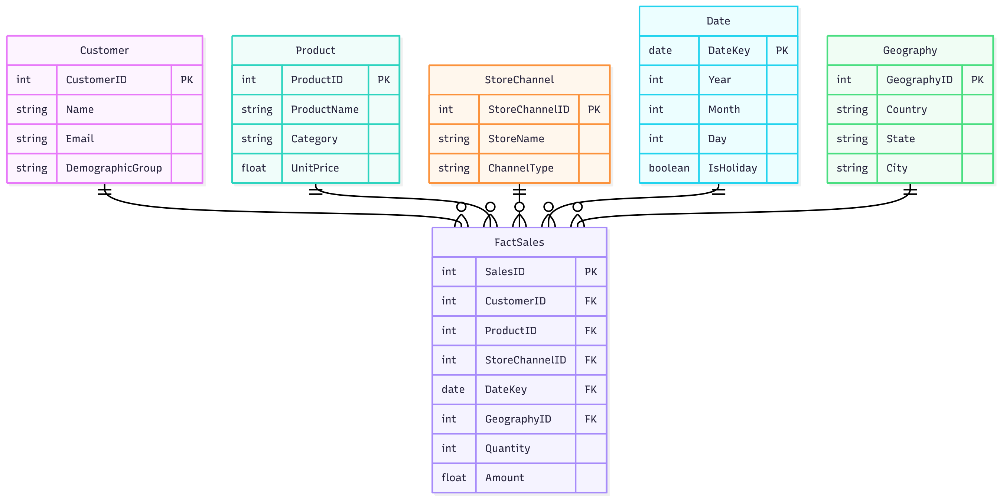
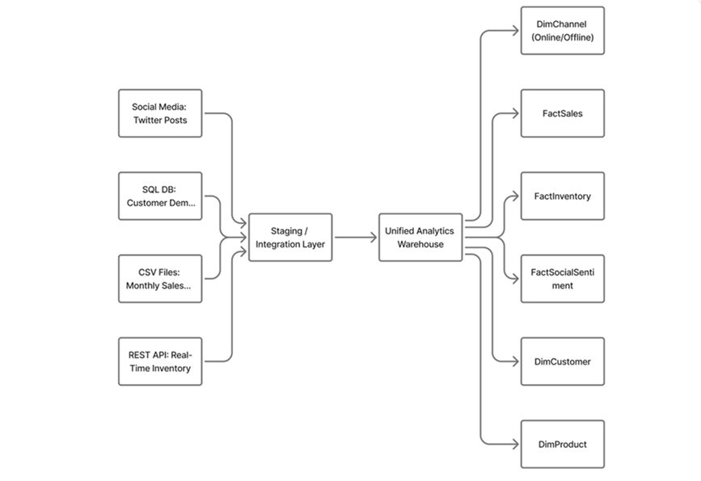
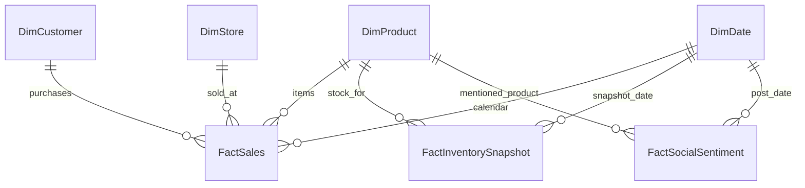

# Question 1

You are hired by a retail company that sells both online and offline. They provide you with the following data sources:

- **An SQL database containing customer demographics**
- **CSV files with monthly sales transactions**
- **A REST API providing real-time product inventory**
- **Social media posts scraped from public Twitter accounts about the brand**

---

## Task

Design a complete end-to-end data analytics pipeline for this scenario. Your answer must include:

1. **Identification and justification of the type of each data source**  
   *(structured / semi-structured / unstructured; internal vs external; streaming vs batch)*

2. **A detailed data ingestion plan**, specifying tools/technologies *(any are allowed)*

3. **A full preprocessing workflow** for each data source

4. **A unified data model** *(diagram or explanation)* showing how data from all sources will integrate

5. **A discussion of data quality risks** and how you would mitigate them

---

## 1) Data Source Classification

Before designing the ingestion and processing layers of our pipeline, we must first define the characteristics of our inputs. The architectural decisions for storage, processing engines, and scheduling depend entirely on three key factors:
1.	Structure: How organized is the data? (Affects parsing and schema validation).
2.	Origin: Where does it come from? (Affects security, networking, and access controls).
3.	Velocity (Ingestion Mode): How frequently is data generated and how quickly is it needed? (Determines streaming vs. batch architecture).
The following table summarizes the classification of the retail company's four data sources against these criteria:

| Data Source | Structure Type | Origin | Ingestion Mode | Justification |
|---|---|---|---|---|
| SQL database (customer demographics) | Structured (relational tables) | Internal | Batch (daily/weekly extracts); optionally near-real-time via CDC | Schema-defined tables (e.g., `Customers`, `Addresses`); transactional system of record |
| CSV files (monthly sales transactions) | Semi-structured (delimited text) | Internal | Batch (monthly) | Files from POS/e-commerce exports; may vary in headers, delimiters, and encodings |
| REST API (real-time product inventory) | Semi-structured (JSON) | Internal or partner | Streaming/near-real-time (polled or webhooks) | Endpoint(s) like `/inventory` return JSON with stock levels; latency-sensitive |
| Social media posts (Twitter/X) | Unstructured (text + metadata) | External | Streaming (firehose/stream API) or Batch (periodic scrape) | Free-form text, emojis, hashtags; metadata (user, timestamp, geo) in JSON

---

## 2) Data Ingestion Plan

| Source | Ingestion Method | Tools/Tech | Landing Zones | Orchestration |
|---|---|---|---|---|
| SQL (demographics) | Incremental extract via JDBC/ODBC; Change Data Capture (CDC) | Azure Data Factory / Synapse pipelines; Debezium (CDC); Sqoop (if Hadoop) | Raw zone (Parquet/Delta); relational staging | ADF triggers; Airflow Directed Acyclic Graphs (DAGs) |
| CSV (sales) | Secure file pickup (SFTP/Blob) + schema-on-read | ADF copy activity; Azure Databricks Autoloader; AWS Glue; Python (pandas) | Raw file zone -> curated zone | Event-based triggers on file arrival |
| REST API (inventory) | Polling or webhook -> queue/stream | Azure Functions; Logic Apps; Kafka; Event Hubs | Streaming bronze (JSON) -> silver (flattened) | Serverless function timers; stream processors |
| Social Media Tweets (Twitter/X) | API/stream ingestion -> queue | Tweepy/official API; Kafka Connect; Event Hubs | Raw JSON stream -> NLP-ready store | Stream jobs (Databricks Structured Streaming)

**Security & Governance:** Managed identities, secret vaults (Key Vault), private endpoints, PII tokenization for customer data, data lineage via Purview.

---

## 3) Preprocessing Workflows

### 3.1 SQL (Customer Demographics)
- Profile schema & constraints
- Deduplicate by customer ID; merge households
- Standardize addresses (postal code formats), phone normalization
- Handle nulls via business rules (e.g., infer city from postal code)
- PII masking/tokenization for analytics
- Slowly Changing Dimensions (SCD Type 2) for attribute change history

### 3.2 CSV (Monthly Sales)
- Validate file name patterns and headers
- Normalize encodings (UTF-8), delimiter detection
- Cast types (dates, numerics); currency normalization
- Join to product and customer dimensions; create fact tables (`FactSales`)
- Outlier detection (returns, extreme discounts)

### 3.3 REST API (Inventory)
- JSON schema validation; flatten nested structures
- Upsert inventory snapshots; compute stock deltas
- Timezone normalization; latency monitoring
- Handle API rate limits/backoff; retry with idempotency keys

### 3.4 Social (Twitter/X)
- Language detection; remove spam/bots
- Text cleaning (URLs, emojis, hashtags); tokenization
- Sentiment analysis (rule-based/ML); topic modeling
- Map mentions to products via dictionary/embedding similarity
- Aggregate by time & campaign for marketing dashboards

---

## 4) Unified Data Model

At a high level, use a **star schema** for sales analytics with conformed dimensions, and a **snapshot/CDC** table for inventory. Social data links via fuzzy product mapping and time.

- **Dimensions:** `DimCustomer`, `DimProduct`, `DimStore/Channel`, `DimDate`, `DimGeography`
- **Facts:** `FactSales` (transactions), `FactInventorySnapshot` (stock levels)
- **Social Analytics:** `FactSocialSentiment` with keys to `DimProduct` (via mapping) and `DimDate`

### Mermaid Diagram

---

## 5) Data Quality Risks & Mitigations

| Risk | Description | Mitigation |
|---|---|---|
| Inconsistent schemas | CSV headers change; API fields evolve | Schema registry; versioned contracts; validation tests |
| Duplicates | Multiple customer records; repeated sales lines | Surrogate keys; fuzzy matching rules; dedupe constraints |
| Missing/incorrect values | Null demographics; bad dates | Data quality rules; imputation; exception queues |
| Time skew | Stream vs batch timestamp misalignment | Timezone normalization; watermarking; event-time processing |
| API reliability | Rate limits, outages | Exponential backoff; caching; message queues |
| PII exposure | Sensitive fields in analytics | Tokenization; column-level security; access audits, Data Masking |
| Social noise/bias | Bot activity; sarcasm in sentiment | Bot filters; human-in-the-loop review; model monitoring |

---

## 6) Outputs & Consumption
- Curated Lakehouse (Delta/Parquet)
- BI dashboards (Power BI), customer cohorts, product performance
- Real-time inventory alerts, replenishment recommendations
- Marketing insights from social sentiment and campaigns

---

## 7) Orchestration & Monitoring
- **Scheduling:** ADF/Airflow; SLAs per source
- **Lineage & Catalog:** Azure Purview
- **Observability:** Data quality metrics (Great Expectations), cost and performance dashboards

---

## 8) Notes
- Replace tools with your preferred cloud stack (AWS/GCP) while keeping the architecture principles.

